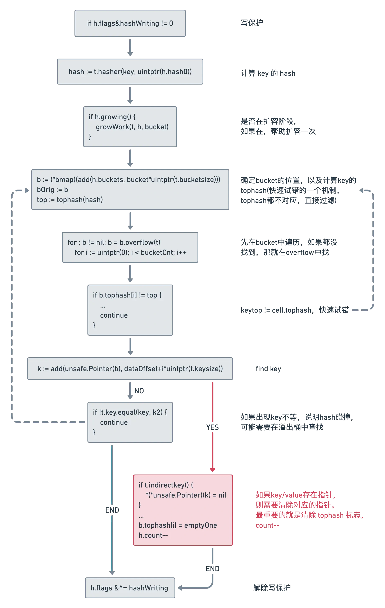
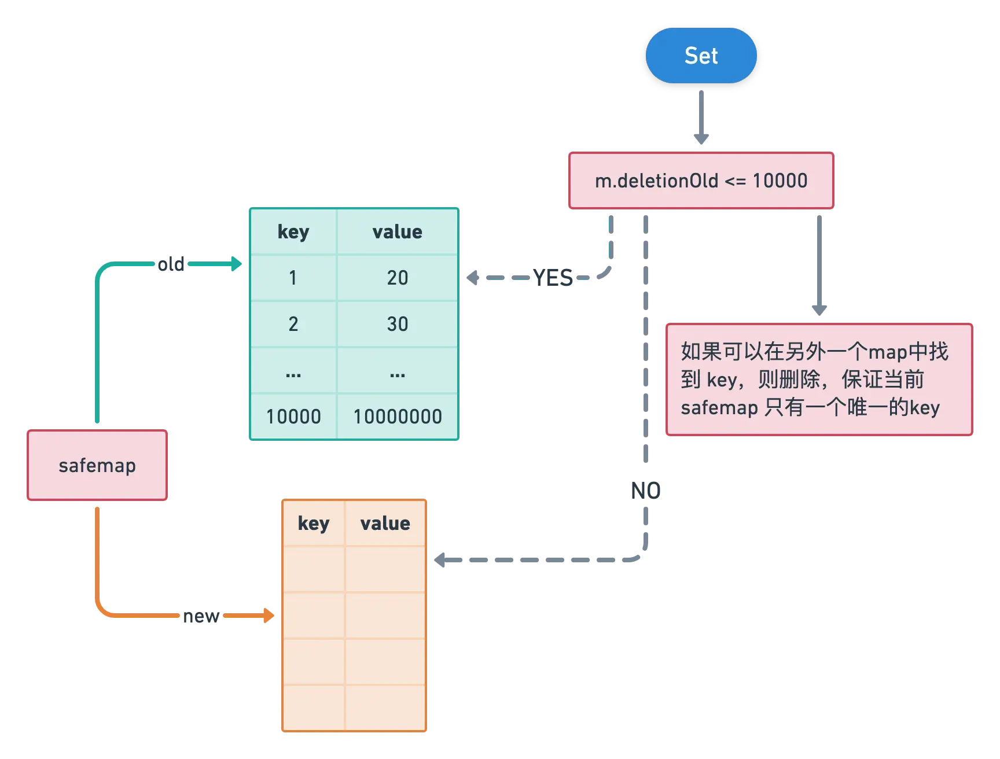
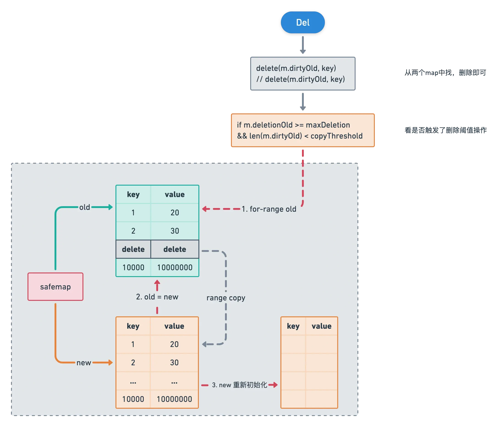

# expireMap

> 实现了一个可以过期key的缓存，默认过期key时间为24小时

## Cacher接口

1. Get(key string, timestamp time.Duration) (interface{}, error) // 支持传参timestamp进行key更新存活时间

2. Set(key string, value interface{}, timestamp time.Duration) error

3. Delete(key string) error

4. TTL(key string) int64 // 精度为秒

5. Size() int

 

## 关于OOM

采用了两个map进行相互转换的方法实现map删除key时的内存占用问题，缓解内存压力

 

## 原理图

>map官方的delete底层原理

>set实现

>del实现

-----------------------------------------

## 参考资料

[1] 
runtime: shrink map as elements are deleted: <https://github.com/golang/go/issues/20135>

[2] 
proposal: runtime: add way to clear and reuse a map's working storage: <https://github.com/golang/go/issues/45328>

[3] 
github.com/zeromicro/go-zero/core/collection/safemap.go

